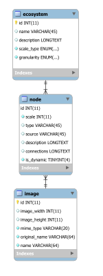

# Database

Database structure of the project.

## EER Diagram



## SQL Create Scripts

### Table `ecosystem`

```sql
CREATE TABLE `ecosystem` (
  `id` int(11) NOT NULL AUTO_INCREMENT,
  `name` varchar(45) DEFAULT NULL,
  `description` longtext,
  `scale_type` enum('space','time',' intensity','generic') NOT NULL DEFAULT 'generic',
  `granularity` enum('10','2','linear') NOT NULL DEFAULT '10' COMMENT '10: Powers of 10, \n2: Powers of 2, \nlinear: Linear granularity ',
  PRIMARY KEY (`id`),
  UNIQUE KEY `id_UNIQUE` (`id`)
) ENGINE=InnoDB AUTO_INCREMENT=2 DEFAULT CHARSET=utf8;

```

### Table `image`

todo
