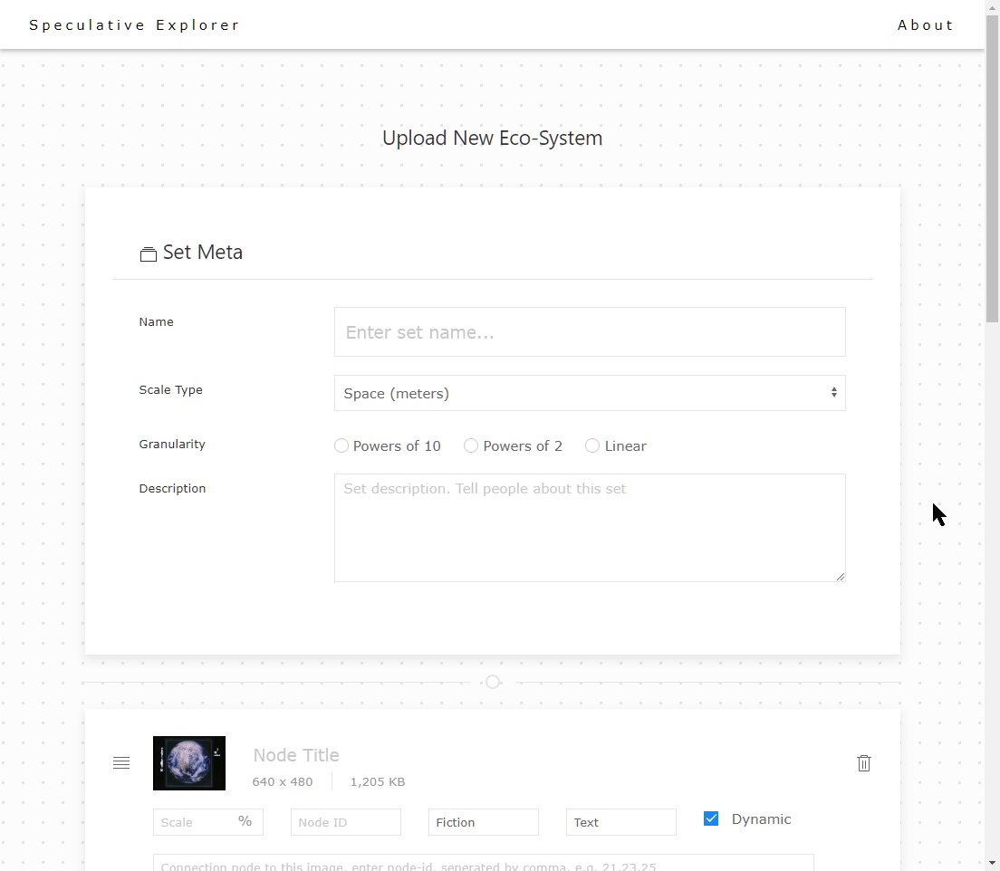

# Plans and TODOs

## Plans

 - [x] `Jan-10-2019` Swiper.js customization for expanding effects
 - [x] Load image sets data with json 
 - [x] |- Animation
 - [X] |---- Fade other ecosystems which are not active
 - [x] Auto layout (not fixed to 500px height)
 - [x] `BUG` bug of move-horizontally but not actually moves any slide, vertical slides got disappeared
 - [ ] `BUG` bug of when click on a non-active slide, not expanding correctly
 - [x] Fix image size
 - [x] `Jan-17-2019` Caption design
 - [x] |- Nav indicators
 - [x] |---- Nav indicators animation
 - [x] Parallax bg
 - [x] `Jan-19-2019` Database structure
 - [ ] Image lazy load
 - [x] |- `Jan-21-2019` Comparison mode
 - [x] |---- Responsive design
 - [x] |---- Connections drawing in WebGL
 - [x] |---- Layout
 - [x] |---- `Jan-26-2019` Data loading
 - [x] `Jan-26-2019` Ecosystem sync moving
 - [ ] Backend rendering
 - [x] |- Upload page
 - [x] |---- Upload function backend, infrastructures
 - [x] |---- `Jan-28-2019` Upload GUI
 - [x] |---- `Jan-28-2019` Upload frontend form implemented base on the [`Metadata field.doc`]()

## Current Progress

Frontend design v1 for the `Comparison` and `Ecosystem` mode completed. Database structure ready. 

##### Comparision and Ecosystem

---

##### Comparision Mode:

---

##### Ecosystem Mode:

##### Upload UI

---

### Coming Plans: 

 - [ ] |- [Backend](../README.md) 
 
